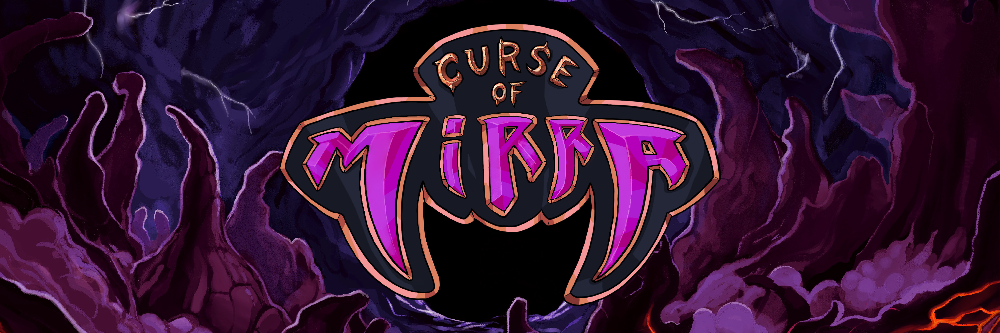

# Curse of Mirra



## Table of Contents

- [Curse of Mirra](#curse-of-mirra)
  - [Table of Contents](#table-of-contents)
  - [About](#about)
  - [Licensing](#licensing)
  - [Requirements](#requirements)
  - [Suggested Development Environment](#suggested-development-environment)
  - [Project and Unity Setup](#project-and-unity-setup)
  - [Running the Backend](#running-the-backend)
  - [Documentation](#documentation)
  - [Contact and Socials](#contact-and-socials)

## About

Welcome to the realm of Curse of Mirra, crafted by LambdaClass.

Curse of Mirra is the inaugural game built on our groundbreaking [Game Backend](https://github.com/lambdaclass/game_backend). This open source backend, meticulously developed by Lambda, ensures seamless and reliable gameplay.

Step into a universe where the destinies of heroes from four planets collide in an epic struggle for the favor of Mirra, a capricious deity known for manipulating entire societies by exploiting their deepest desires. Brace yourself for an immersive journey where every decision matters, and the pursuit of victory comes with the ever-present thrill of unpredictability.

Curse of Mirra is more than a game; it's an adventure into a world where strategy, skill, and a dash of chaos converge. Join the battle and confront the challenges that lie ahead in this captivating and dynamic gaming experience. The stage is set, and the Curse of Mirra awaits—embrace the challenge and become a legend!

<div>
  <div float="center">
      
     
  </div>
  <div float="center">
    
    
  </div>
<div>

## Licensing

The code is licensed under the Apache 2 license, while the music and graphics are licensed under a CC attribution and share-alike license.

Find our open source 3D models, concept art, music, lore and more in our [Curse of Mirra Open Game Assets](https://github.com/lambdaclass/curse_of_mirra_assets) repository.

## Requirements

Ensure you have the following dependencies installed:

- **Rust:**
  - [Install Rust](https://www.rust-lang.org/tools/install)
- **Elixir and Erlang:**
  - [Install Elixir using ASDF](https://thinkingelixir.com/install-elixir-using-asdf/)
  - Erlang/OTP 26
  - Elixir 1.15.4
- **Unity:**
  - [Download Unity](https://unity.com/unity-hub)
- **Docker**

## Suggested Development Environment

Set up your environment with the following steps:

- Download the [.NET SDK](https://dotnet.microsoft.com/es-es/download/dotnet/thank-you/sdk-7.0.403-macos-arm64-installer) and [Mono](https://www.mono-project.com/download/stable/) for your operating system.
- In Unity preferences, under "External Tools", check the following preferences:
  - Embedded packages
  - Local packages
  - Registry packages
  - Git packages
  - Built-in packages
- In VSCode, download the ```C# Dev Kit``` extension. 
  
Your code should now autocomplete.

## Project and Unity Setup
- Open a terminal and clone the project:

```bash
git clone https://github.com/lambdaclass/curse_of_mirra
```

- In Unity Hub, click on the add project button and select the `curse_of_myrra/client` folder.
- Choose the correct editor version and download the [Top Down Engine](https://assetstore.unity.com/packages/templates/systems/topdown-engine-89636) by [More Mountains](https://moremountains.com). Include it in the `Assets/ThirdParty` folder after purchasing the license.
- To test the game, select the scene in `Assets/Scenes/TitleScreen` and run it by clicking the play button.

## Running the Backend

For local testing, use the [game backend](https://github.com/lambdaclass/game_backend). Ensure Docker is running and execute:

```bash
git clone https://github.com/lambdaclass/game_backend
make db
make setup
make start
```
Remember to set ```localhost``` as the server.

## Documentation

Explore our documentation [here](https://docs.curseofmirra.com/) or run it locally. To run locally, install:

```
cargo install mdbook
cargo install mdbook-mermaid
```

Then run:

```
make docs
```

Open: [http://localhost:3000/](http://localhost:3000/ios_builds.html)

Some key documentation pages:

- [Message protocol](https://docs.curseofmirra.com/message_protocol.html)
- [Android build](https://docs.curseofmirra.com/android_builds.html)
- [IOs builds](https://docs.curseofmirra.com/ios_builds.html)

## Contact and Socials

If you have any questions, feedback, or comments:

- **Email:** gamedev@lambdaclass.com

We share our development and creative process in the open, follow us for frequent updates on our game:

- **Twitter:** [@CurseOfMirra](https://twitter.com/curseofmirra)
- **Reddit:** [r/curseofmirra](https://www.reddit.com/r/curseofmirra/)
- **Discord:** [join link](https://discord.gg/hxDRsbCpzC)
- **Telegram:** [t.me/curseofmirra](https://t.me/curseofmirra)
