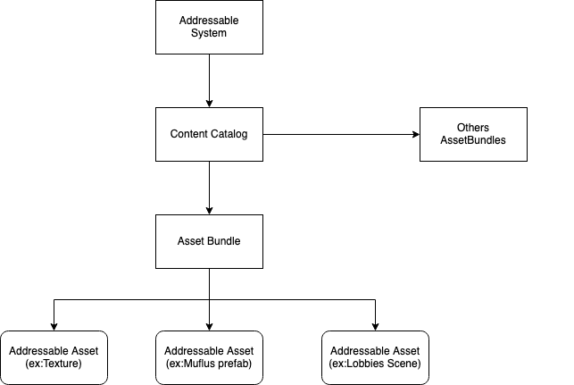
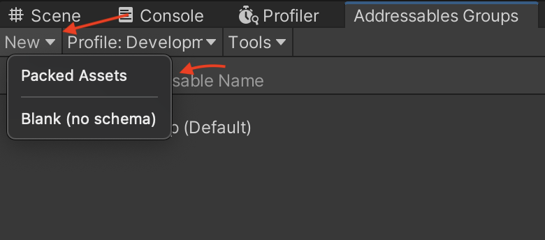
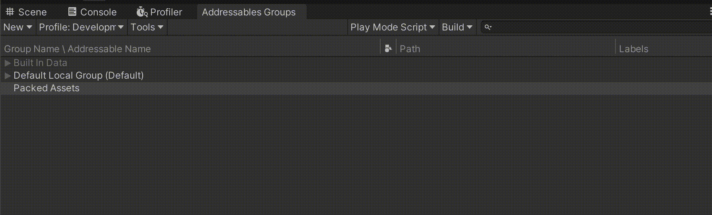
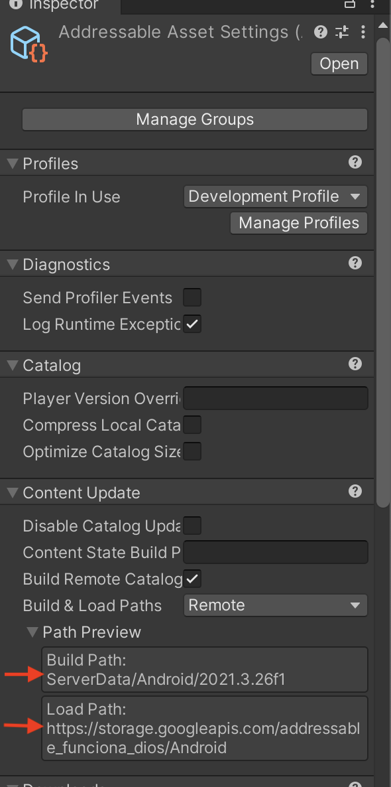
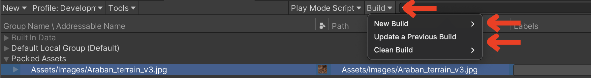
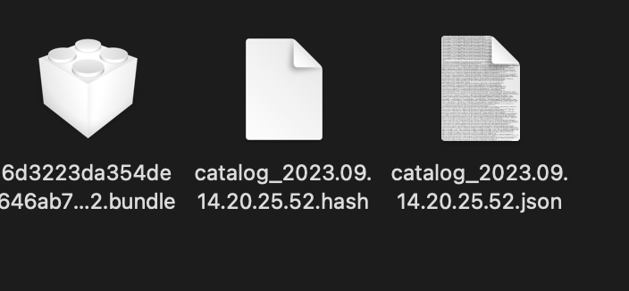

# Unity Addressables
## Quick overview

Addressables are a way to easily handle content creation and dynamically loading/unloading assets at runtime, here’s an overview of key terms:
- Asset Bundle: A container that holds non-code assets that can be loaded at runtime
- Addressable Asset: An asset that is marked as “Addressable” will be used by the addressable system.
- Content Catalog: The data store that is used to look up an asset’s physical location via the address.
- Address: Property of the asset that represents how it can be looked up in the content catalog (the key).
- Label: An optional property that provides an extra layer of control over querying for addressable assets. 

## How to create/update asset bundles
1. First of all make sure that you have installed the Addressable package, you can check it in Window > Package Manager. if you don’t have the Addressables package, install it.

2. You can open the group panel by going to Window > Asset Management > Addressables > Groups.
3. You can add new groups through the Create menu and drag / drop addressable assets between existing groups to move them.

(gif)

4. Make sure that the Remote paths are correct so you can download the assets without errors.

- Build Path is where yout bundles and catalogs will be create for them to be uploaded to the remote server.
- Load Path is the remote server path where the assets will be stored and downloaded from.

5. Now you have to build the asset bundle to be uploaded to the remote server. You have 2 options to build the asset:
    - New build > Default build script : This will create a new build fot the assets, if you don't already have one. This is the correct option to start.
    - Update a previous build : If you already have a previous build of the asset bundle made and you changes the assets, this is the correct option. It will update the bundle without creating a new one.

6. These 3 files will be created in the Build Path directory. Upload them to the remote server and the build the game.

7. Finally, once the game build is done. You can test the addressables by updating the asset bundle with a new image and doung a Update previous build as we explain before. Upload them to the remote server and test in the App if they have changed.

## The Scripts

We have a Script called CustomSceneLoader where we initialize the addressable system to load the assets from the remote server.

 ``public List<AssetLabelReference> labels = new List<AssetLabelReference>()`` the list of the asset labels, assigned in the editor. You either can use a list of ``AssetLabelReference`` or ``AssetLabelReference``, there is multiple ways of doing this.

``Addressables.InitializeAsync().Completed += Addressables_Completed;`` this line has the responsibility of setting up the runtime data for Addressables. Loading the ContentCatalog and checking for Updates. On complete we subscribe the ``Addressables_Completed`` method.

``private void Addressables_Completed(AsyncOperationHandle<IResourceLocator> handle)`` this method will load each one of the ``AssetLabelReference`` assigned in the editor. Leaving them ready for their use.

