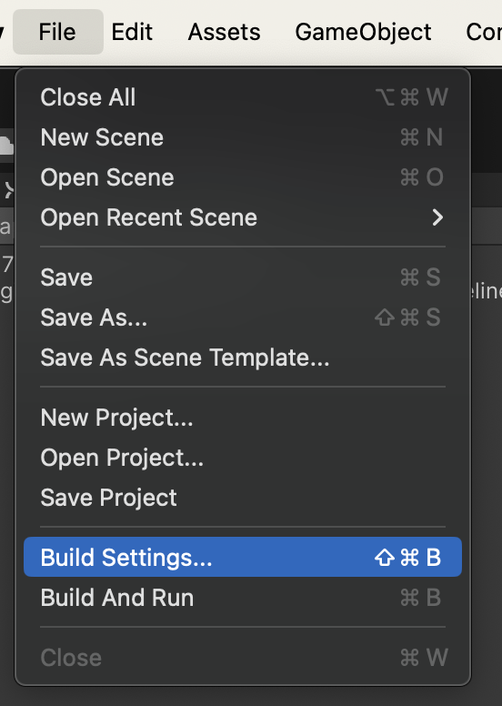
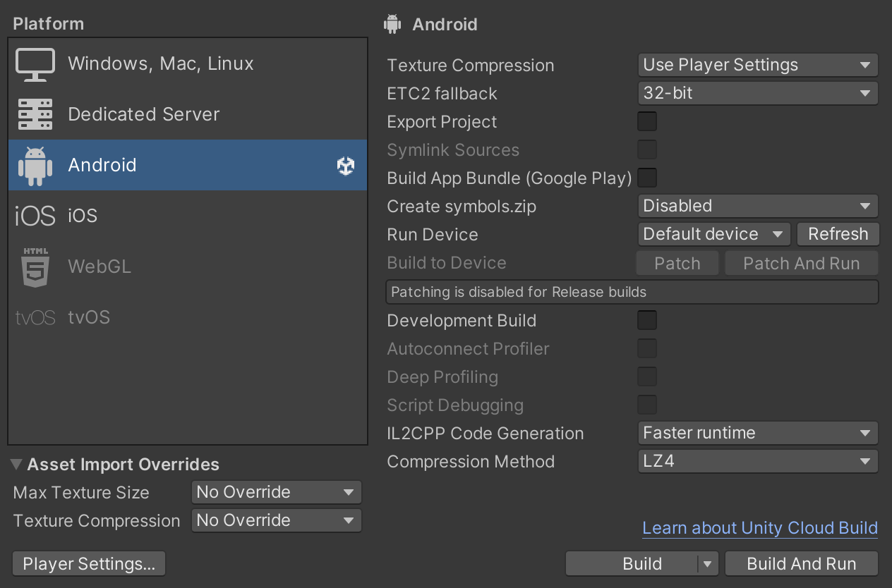
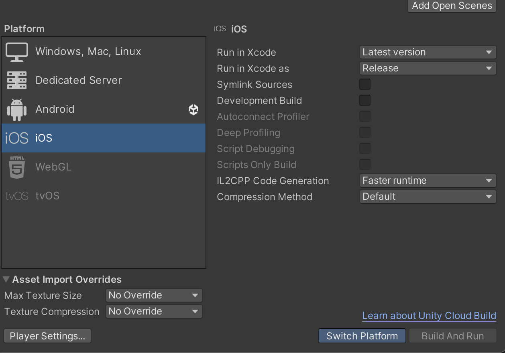
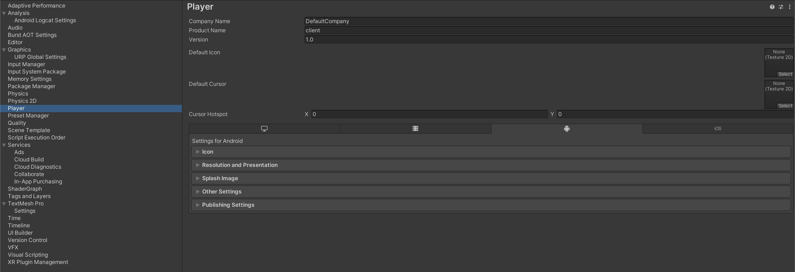

# Build Settings

We have build settings in Unity that directly affect how the game functions and renders. Follow these steps to achieve our ideal configuration.

## 1 - Open the Build Settings window:

## 2 - Ensure to copy the settings for your selected device:

Here choose your selected device (Android or IOS). Copy the following settings for each. Note that if you have the wrong device selected you have to select `switch platform` which may take a little while.

## 3 - Open the Player Settings window:

The `player settings` option can be found at the bottom left corner of the build settings window. Then, select the `Player` tab.

## 4 - Basic player settings:

Here you can find common settings shared across devices such as the name of the build (Product Name) and the icon to be shown (Default Icon).

## 5 - Device specific settings:

As you can see, we are provided with tabs for each device's settings:

- Windows, Mac and Linux
- Dedicated Server
- Android
- IOS

Here are the settings used by our development team:

### Windows, Mac and Linux tab

Resolution and Presentation:

- Run in Background: turn on

### Android tab

#### Resolution and Presentation

Orientation:

- Default Orientation: Landscape Left

#### Other Settings

Rendering:

- Texture compression format: ASTC

Identification:

- Minimum API Level: Android 10.0 (API level 29)

Configuration:

- Scripting backend: IL2CPP.
- Target Architectures: add ARM64.

#### Publishing settings

- Activated Custom Main Gradle Template
- Activated Custom Base Gradle Template
- Activated Custom Properties Template

### IOS tab

#### Resolution and Presentation

Orientation:

- Default Orientation: Landscape Left

#### Other Settings

Rendering:

- Texture compression format: ASTC

Configuration:

- Supported URL schemes:
  - Size: 1
  - Element 0: {REVERSED_CLIENT_ID}
    - You can find the REVERSED_CLIENT_ID in the .plist file downloaded from iOS OAuth credentials.
