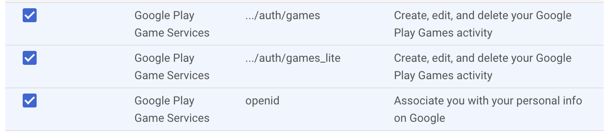
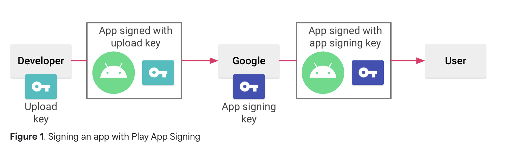

# Google Sign-in

## Dependencies

Google External Dependency Manager for Unity: https://github.com/googlesamples/unity-jar-resolver

Unity Google plugin: https://github.com/googlesamples/google-signin-unity

OAuth to authenticate and authorize the players. We use [Google Cloud Console](https://console.cloud.google.com/apis/credentials) to create and manage the OAuth credentials.

Cocoapods: `brew install cocoapods`

- We need cocoapods for iOS builds, because we use the following pod https://cocoapods.org/pods/GoogleSignIn
- Cocoapods needs ruby 3: `brew install ruby`

## Google Cloud Console config

- Create new project.
- Add Google Play Games API under "**API’s and Services**".
- OAuth consent screen:
    - In the 2nd step, you must set the following three scopes:
        
        
- Create new OAuth Client ID (Web)
- Create new OAuth Client ID (Android)
    - Project name: here you write the app’s name shown in Google Play Console, it’s the one that starts with "**com.**"
        - It’s important to note that this name is case-sensitive.
        - In case you don’t use Google Play Console:
            - You set the name according to your Unity project settings. It’s "**com.{CompanyName}.{ProductName}**".
    - SHA-1 certificate fingerprint: here google console tells you to use the following command `keytool -keystore path-to-keystore -list -v` but we don’t use the keystore SHA-1, we use the google play app signing key instead. This restricts usage to your Android apps.
        - To retrieve it, go to https://play.google.com/console/.
        - Select your app.
        - In the left side bar, go to Setup > App signing.
        - Copy the SHA-1 certificate under "**App signing key certificate"**
        - Paste it in google cloud console.
        - In case you don’t use Google Play Console:
            - Run `keytool -keystore path-to-keystore -list -v`
            - You may need Java Development Kit to run the keytool command. You can download JDK for macOS [here](https://www.oracle.com/java/technologies/downloads/?er=221886).
            - The .keystore file is the one you use in Unity Editor under "**Android Project Settings > Publishing Settings > Keystore Manager**".
        - The following image and link explains the google play signature override.
            - https://developer.android.com/studio/publish/app-signing
            
- Create new OAuth Client ID (iOS)
    - Bundle ID: here you write the app’s name shown in Google Play Console, it’s the one that starts with "**com.**"
        - It’s the same as Android Project Name.

When you’re done with the credentials, you must set in the code the following:

- Copy Client ID (Web) and replace it in `client/Assets/Scripts/GoogleSignIn/GoogleSignInController.cs`, `webClientIdGoogle` variable.
- Under iOS OAuth credentials, download the .plist file and replace its content in `client/Assets/StreamingAssets/GoogleService-Info.plist` .

## Unity Config (project settings)

### Other Settings tab

- Scripting backend: IL2CPP.
- Target Architectures: add ARM64.
- (iOS tab) Supported URL schemes:
    - Size: 1
    - Element 0: {REVERSED_CLIENT_ID}
        - You can find the REVERSED_CLIENT_ID in the .plist file downloaded from iOS OAuth credentials.

### Publishing settings

- Activated Custom Main Gradle Template
- Activated Custom Base Gradle Template
- Activated Custom Properties Template

## Future improvements

### Use GPGS and Apple Game Center instead of google plugin (deprecated)

Useful links:

- [Apple Game Center Authentication in Unity](https://docs.unity.com/ugs/en-us/manual/authentication/manual/platform-signin-apple-game-center)
- [Google Play Games Authentication in Unity](https://docs.unity.com/ugs/en-us/manual/authentication/manual/platform-signin-google-play-games)
- [GPGS docs](https://developers.google.com/games/services?hl=es-419)
- [How to enable GPGS](https://developers.google.com/games/services/console/enabling)
- [How to add google SignIn for iOS](https://developers.google.com/identity/sign-in/ios/start-integrating?hl=es-419)

### Add diagrams for google sign in process
