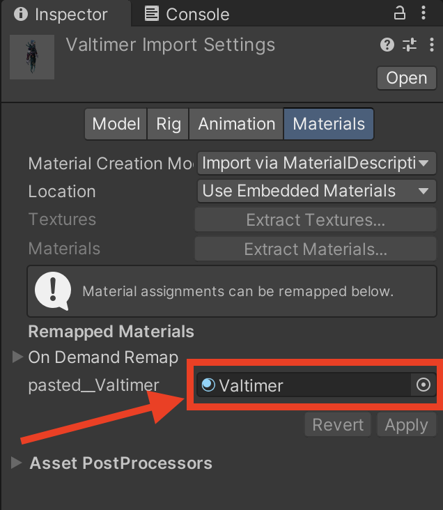
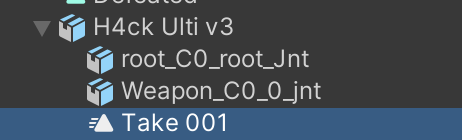

# How to add a new character

## Import the character assets to the project
- Add the textures (.jpg) to `client/Assets/Textures/Characters/{new_character_name}` folder.

- Create a material for the model inside `client/Assets/Materials/Characters/{new_character_name}` and assign the added textures to the newly created material like this:
    - `BaseMap -> Base Map`
    - `MaskMap -> Metalic Map`
    - `Normal -> Normal Map`
    - `Emissive -> Emission Map`

- Add the model (.fbx) to the `client/Assets/Models/Characters/{new_character_name}` folder, then, with the model selected, on the inspector tab, inside the `Materials` section, set the created material to the field inside, this field may reference the name of the character or have a "txt" or "material" inside it's name, there probably won't be more fields to set, so it should be easy to find (see the image below).

- Maybe you'll have to adjust the `Scale Factor` setting of the model, more on this on the character prefab section of this doc.

- Add the animations to `client/Assets/Animations/{new_character_name}`, each animations may come as an animation clip (.anim) file or inside a model (.fbx), if this last one is the case, then you must import those files to Unity and one by one expand the contents, select the animation clip from inside and copy and paste it in the previously referenced location and rename it so it is clear which action the animation represents. The image below shows a model with the Ultimate ability animation clip inside ("Take 001").

## Animator controller
Inside `client/Assets/Animations/{new_character_name}` create an Animator Controller for the respective character. This controller will hold a state representative of each animation the character will make, they are created by drag and dropping the animation clips inside the animator window with the controller selected, the parameters that will trigger the transitions between these animations and the transitions between states themselves, all of these have to be manually defined depending on the character's specifications. For most transitions the common rule is to have the `Has Exit Time` option disabled and a `Transition Duration` of 0.2 seconds, but this is just a rule of thumb, for correct implementation each transition must be analyzed separately.

## Character's prefab
To create the character's prefab it's best to duplicate one from an already existing character and change the components and references for the new one. They are located in `client/Assets/Prefabs/Characters`. With this prefab open, place the model inside `CharacterModelAnchor` use the model from the character you copied the prefab from as reference for the size of the model, here you'll have to adjust the `Scale Factor` of the model and the `Scale` of the transform component of the model inside the prefab (currently we set it to 3.2 and just change the `Scale Factor`), after you are happy with the size remember to remove the duplicated model.

In the model object of the prefab you must attach the animator controller you created as a component and reference it inside the root object of the prefab, in the `Custom Character` script component, under the `Character Animator` attribute.

Inside the `CharacterBase` object of the prefab, you'll have to set the `SkinnedMeshRenderer` of the Character Feedback Manager component to the body mesh of the characters model.

As you'll probably have seen inside the parent object of the prefab and the `CharacterBase` object, there are multiple components with many attributes that can be set, you must remove all the references to the previous character if you duplicated the prefab and add references to the new character if they correspond.

## Character's and abilities scriptable objects
Inside `client/Assets/ScriptableObjects/Characters` you'll find the scriptable objects for all the character, maybe there is even one for the character you are trying to implement now, if not create it (`Create > CoM Character`). Now you must assign the correct values for the respective fields, for the `Skills Info` array you'll must create scriptable objects for the character's skills inside `client/Assets/ScriptableObjects/Skills/{new_character_name}` (`Create > CoM Character`). Both the skill's and the character's scriptable object itself have many fields that must be set respective to the character's features and characteristics.

After the previous steps are complete you must go to the `TitleScreen` scene and add the newly implemented character's scriptable object to the `All Characters` collection inside `CharactersManager`. Also inside the `CharactersManager.cs` there is a field `availableCharacterNames` where you'll have to add the name of the new character.

With all this done the only thing left to do is check the character is available and playable, if some values haven't been set correctly then exceptions will arise while testing, you must then fix these issues.

## Notes
- It's a good idea to lean on already implemented characters when getting stuck, but don't be afraid to raise your voice if you belive the pipeline to add a character or this documentation could use some improvement or if you don't understand something.
