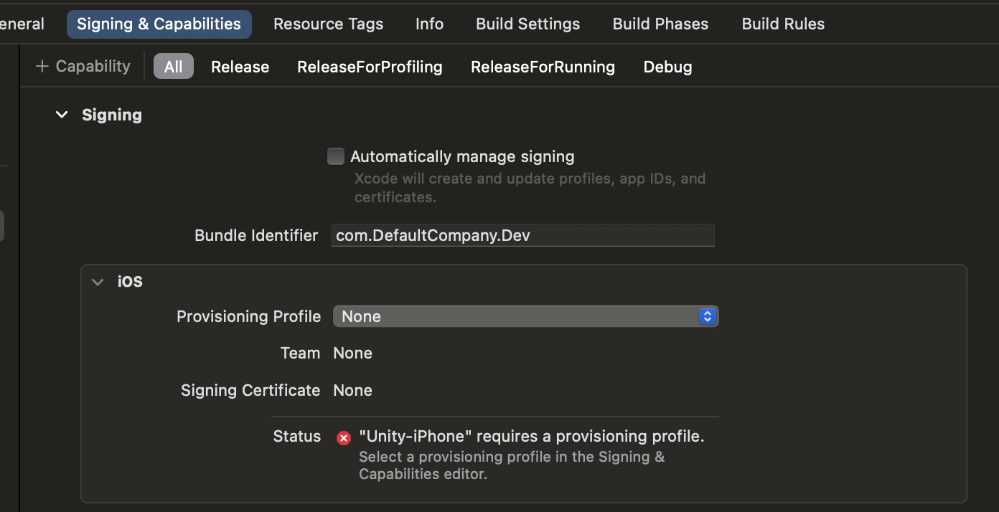
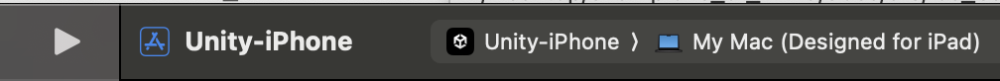

# Steps to generate a build for iOS and run it in an iPhone:

1. In iPhone, enable developer mode `Settings -> Privacy and Security -> Developer mode -> On`. In desktop, open the Unity project and connect your IOS device. Allow popup permissions for file transfer on both your computer and phone if prompted.

2. In Unity, go to `File -> Build Settings -> IOS -> Build and Run`.

3. Select new folder since all inside this will be overwritten. If Xcode doesn't open automatically, open the .xcodeproj file with Xcode.

4. Go to `Unity-iPhone -> Signing and Capabilities`. You can also click the error icon in the top bar. Then, click the error message at the left side of the window. This will redirect you to this same tab. You should see the following:

5. Check `Automatically manage signing` toggle.

6. In `Team` selector use personal iOS Account (may need free registration in dev program developer.apple.com). Download provisioning profile if needed.

7. Change bundle identifier to something unique that we wont use for the game. For example: com.myGitUsername.mirraV and so on. Make sure to press Enter after this so Xcode recognizes the input change

8. In Xcode Choose iPhone in the device selector at the topbar of the window. Here is a visual reference of the selector:

9. Build Game in iPhone by pressing the Play button in XCode's top bar, next to the device selector. (visible in the visual reference from step 8)

10. Once the build is done a warning/error may pop up. This is because you are not yet an trusted developer in the device. To trust developer in iPhone go to `settings -> General -> VPN & Device Management -> Developer app -> Trust`.
